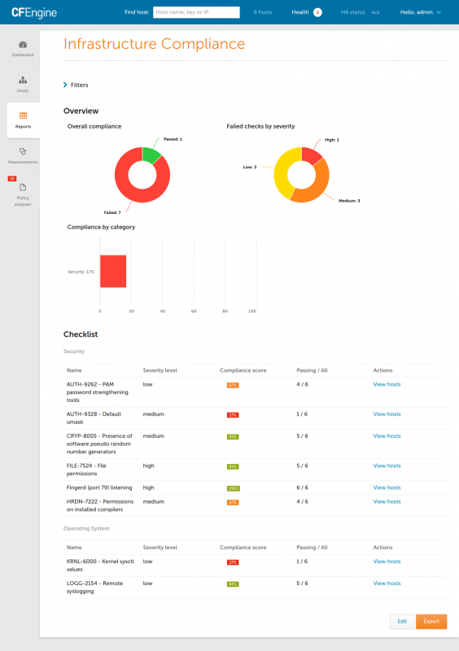
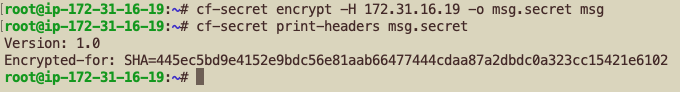
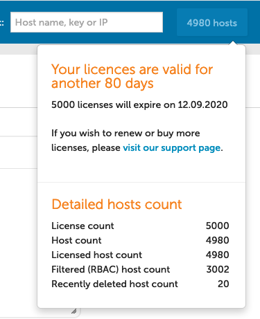

Today we announce the newest additions to CFEngine. CFEngine 3.16 brings several improvements, bug fixes, and new features. The theme for this release has been compliance, and it notably includes a new category of reports for proving compliance to regulation and other compliance frameworks in high level, easy to read reports.

If you are interested to learn more about CFEngine, schedule training, or hear about pricing options, feel free to [reach out to us!](https://cfengine.com/engage/contact/)

# What's new

## Compliance reports (Beta)

Compliance reports allow you to implement internal or regulatory frameworks as a list of checks which have to pass on all or a subset of your hosts. The system is very flexible, allowing you to implement checks using Inventory values, software updates, or even custom SQL queries. Once the report is completed, the results can be exported to PDF, or scheduled to run at a fixed interval, for example every week. Different compliance reports can be set up for various stakeholders in your organization, and automated e-mails with PDFs can bring this valuable information to people/departments which don't use Mission Portal directly. This feature is still in beta, and a lot of the UI will change, but we are excited to show it to you and start getting some feedback on it, so it will be in a great shape for the next LTS release.

\[caption id="attachment\_10076" align="alignnone" width="564"\] Compliance report (beta)\[/caption\]

## Secret Encryption

A new tool has been introduced, `cf-secret`, which allows you to encrypt files for specific hosts in your infrastructure. It is open-source, available in both community and enterprise packages, and can be used from policy or as a stand-alone tool.

 [Read more about `cf-secret` here.](https://cfengine.com/company/blog-detail/cf-secret/)

## Detailed host and license counts

Mission Portal now gives you a detailed overview of your hosts, including the license count, number of recently deleted hosts, as well as the total number of hosts before RBAC filtering is applied. This should clear up some confusion in large infrastructures, especially when you are approaching the license count, and if you decommission hosts frequently. (Unfiltered host count is a separate control in our Role Based Access Control (RBAC) system, so you can grant or remove access to it for any user/role).

\[caption id="attachment\_10075" align="alignnone" width="375"\] Detailed breakdown of license information and host counts\[/caption\]

## New version macros

From CFEngine 3.16 and onward, you can more easily target specific CFEngine versions within the policy language. Previously, you could use the `minimum_version` macro to avoid using newer syntax and features on older versions that don't support it. However, there was no obvious approach to where you would put the alternative (the policy which you want to run on older versions only). For this reason and to allow greater flexibility to policy writers, we have introduced a few new macros:

- `maximum_version`
- `else`
- `at_version`
- `between_versions`
- `before_version`
- `after_version`

[Read more about all these macros in the documentation](https://docs.cfengine.com/docs/3.16/reference-macros.html).

## New functions

CFEngine 3.16.0 introduces 9 new functions. To complement the version macros, which function at a parsing level, we also now have functions for making decisions based on the version of the agent from the policy.

- `[cf_version_after()](https://docs.cfengine.com/docs/3.16/reference-functions-cf_version_after.html)`
- `[cf_version_at()](https://docs.cfengine.com/docs/3.16/reference-functions-cf_version_at.html)`
- `[cf_version_before()](https://docs.cfengine.com/docs/3.16/reference-functions-cf_version_before.html)`
- `[cf_version_between()](https://docs.cfengine.com/docs/3.16/reference-functions-cf_version_between.html)`
- `[cf_version_maximum()](https://docs.cfengine.com/docs/3.16/reference-functions-cf_version_maximum.html)`
- `[cf_version_minimum()](https://docs.cfengine.com/docs/3.16/reference-functions-cf_version_minimum.html)`

A new utility function to strip leading and trailing whitespace was added.

- [`string_trim()`](https://docs.cfengine.com/docs/3.16/reference-functions-string_trim.html)

And two new data validation functions were added for making decisions based on data validity.

- `[validdata()](https://docs.cfengine.com/docs/3.16/reference-functions-validdata.html)`
- [`validjson()`](https://docs.cfengine.com/docs/3.16/reference-functions-validjson.html)

## New files promise type attribute

The new content attribute for `files` type promises make it more clear and concise to promise the full content of a file.

An example illustrating files promise content attribute

bundle agent example\_file\_content
\# @brief Example showing files content
{
  vars:
      "my\_content"
        string => "Hello from var!";

  files:
      "/tmp/hello\_string"
        create => "true",
        content => "Hello from string!";

      "/tmp/hello\_var"
        create => "true",
        content => "$(my\_content)";

  reports:
      "/tmp/hello\_string"
        printfile => cat( $(this.promiser) );
      "/tmp/hello\_var"
        printfile => cat( $(this.promiser) );
}

body printfile cat(file)
\# @brief Report the contents of a file
\# @param file The full path of the file to report
{
        file\_to\_print => "$(file)";
        number\_of\_lines => "inf";
}

bundle agent \_\_main\_\_
{
  methods: "example\_file\_content";
}

Here we can see the results of executing the example above.

\# cf-agent --no-lock --file /tmp/example\_file\_content.cf
R: /tmp/hello\_string
R: Hello from string!
R: /tmp/hello\_var
R: Hello from var!

You can find the [documentation about the content attribute here](https://docs.cfengine.com/docs/3.16/reference-promise-types-files.html#content).

# Changelogs

We have made a lot of smaller improvements, dependency updates, and bug fixes which would not fit into a single blog post. Some of these are brand new to CFEngine 3.16, while some we were also included in the [recent 3.12.5 and 3.15.2 releases](https://cfengine.com/company/blog-detail/cfengine-3-12-5-and-3-15-2-released/). You can read all the details in our changelogs:

- [Core](https://docs.cfengine.com/docs/3.16/guide-latest-release-whatsnew-changelog-core.html)
- [Enterprise](https://docs.cfengine.com/docs/3.16/guide-latest-release-whatsnew-changelog-enterprise.html)
- [Masterfiles](https://docs.cfengine.com/docs/3.16/guide-latest-release-whatsnew-changelog-masterfiles-policy-framework.html)

# Contributing

We are always looking for new **contributions to CFEngine!** Are you unsure how to get started? Please check out our [contributing guide](https://github.com/cfengine/core/blob/master/CONTRIBUTING.md) in addition to the following suggestions.

- Send [documentation](https://docs.cfengine.com/) updates as pull requests to [cfengine/documentation](https://github.com/cfengine/documentation).
- Search for [issues labeled easy or help\_wanted that are OPEN or TODO](https://tracker.mender.io/issues/?jql=project%20%3D%20CFE%20AND%20status%20in%20(Open%2C%20%22To%20Do%22)%20AND%20labels%20in%20(easy%2C%20help_wanted)) that are good candidates for new contributors to [cfengine/core](https://github.com/cfengine/core) or [cfengine/masterfiles](https://github.com/cfengine/masterfiles).
- Fix issues pointed out by [code analysis](https://lgtm.com/projects/g/cfengine/core/alerts/).
